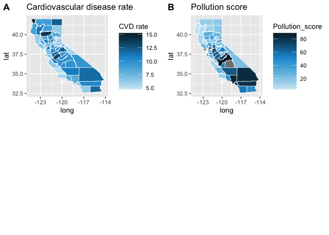
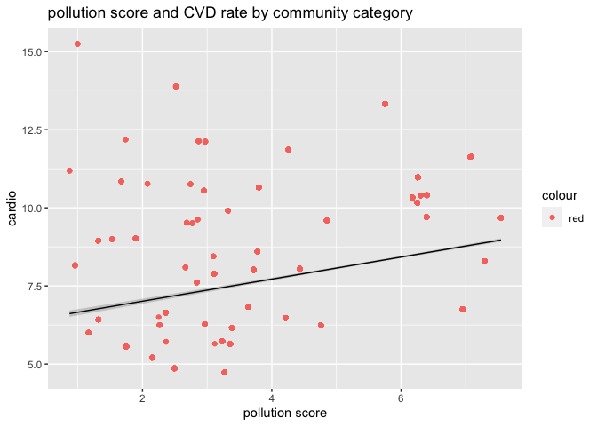

midterm-project
================
Luqing Ren
10/4/2020

This data set includes indicators which reflect environmental conditions
or a population’s vulnerability to environmental pollutants of all
communities in California State.

Cardiovascular disease (CVD) is a leading cause of death both in
California and the United States.There are many risk factors for
developing CVD including diet, lack of exercise, smoking, and air
pollution.

Hypotheses: Is air pollution associated with cardiovascular disease. Is
CVD associated with communities category.

``` r
# load the data set by API
library(httr)
library(data.table)
go_query <- GET("https://data.ca.gov/api/3/action/datastore_search?resource_id=89b3f4e9-0bf8-4690-8c6f-715a717f3fae&limit=10000")
dat <- content(go_query)
dat <- as.list(dat)
dat_1 <- do.call(rbind,lapply(dat$result$records, rbind))
dat_1[dat_1 == "NULL"]= NA
ces <- as.data.frame(dat_1) 
ces <- as.data.table(lapply(ces, unlist))
ces <- as.data.table(lapply(ces,function(x) type.convert(as.character(x), as.is = TRUE)))
```

``` r
#create a new data set including key variables
library(tidyverse)
```

    ## ── Attaching packages ───────────────────────── tidyverse 1.3.0 ──

    ## ✓ ggplot2 3.3.2     ✓ purrr   0.3.4
    ## ✓ tibble  3.0.3     ✓ dplyr   1.0.2
    ## ✓ tidyr   1.1.2     ✓ stringr 1.4.0
    ## ✓ readr   1.3.1     ✓ forcats 0.5.0

    ## ── Conflicts ──────────────────────────── tidyverse_conflicts() ──
    ## x dplyr::between()   masks data.table::between()
    ## x dplyr::filter()    masks stats::filter()
    ## x dplyr::first()     masks data.table::first()
    ## x dplyr::lag()       masks stats::lag()
    ## x dplyr::last()      masks data.table::last()
    ## x purrr::transpose() masks data.table::transpose()

``` r
ces_2 <-
  ces %>% 
  select(`Census Tract`, ZIP, `California County`,Latitude, Longitude,
         `SB 535 Disadvantaged Community`,Ozone,`Ozone Pctl`,
         PM2.5, `PM2.5 Pctl`,Traffic,`Traffic Pctl`,`Tox. Release`, 
         `Tox. Release Pctl`,Asthma,`Cardiovascular Disease`,`Low Birth Weight`,
         Education, Poverty) %>% 
  as.data.table()
#rename column 
colnames(ces_2)[which(colnames(ces_2)=="Cardiovascular Disease")]<- "cardio"
colnames(ces_2)[which(colnames(ces_2)=="Census Tract")]<- "census_trct"
colnames(ces_2)[which(colnames(ces_2)=="California County")]<- "county"
colnames(ces_2)[which(colnames(ces_2)=="SB 535 Disadvantaged Community")]<- "community_cat"
colnames(ces_2)[which(colnames(ces_2)=="Ozone Pctl")]<- "ozone_pct"
colnames(ces_2)[which(colnames(ces_2)=="PM2.5 Pctl")]<- "PM2.5_pct"
colnames(ces_2)[which(colnames(ces_2)=="Traffic Pctl")]<- "traffic_pct"
colnames(ces_2)[which(colnames(ces_2)=="Tox. Release Pctl")]<- "tox_pct"
colnames(ces_2)[which(colnames(ces_2)=="Tox. Release")]<- "tox"
colnames(ces_2)[which(colnames(ces_2)=="Low Birth Weight")]<- "LBW"
# check the data
dim(ces_2)
```

    ## [1] 8035   19

``` r
# summary statistics
ces_2 %>% 
  skimr:: skim() 
```

|                                                  |            |
| :----------------------------------------------- | :--------- |
| Name                                             | Piped data |
| Number of rows                                   | 8035       |
| Number of columns                                | 19         |
| \_\_\_\_\_\_\_\_\_\_\_\_\_\_\_\_\_\_\_\_\_\_\_   |            |
| Column type frequency:                           |            |
| character                                        | 2          |
| numeric                                          | 17         |
| \_\_\_\_\_\_\_\_\_\_\_\_\_\_\_\_\_\_\_\_\_\_\_\_ |            |
| Group variables                                  | None       |

Data summary

**Variable type: character**

| skim\_variable | n\_missing | complete\_rate | min | max | empty | n\_unique | whitespace |
| :------------- | ---------: | -------------: | --: | --: | ----: | --------: | ---------: |
| county         |          0 |              1 |   5 |  15 |     0 |        58 |          0 |
| community\_cat |          0 |              1 |   2 |   3 |     0 |         2 |          0 |

**Variable type: numeric**

| skim\_variable | n\_missing | complete\_rate |          mean |          sd |           p0 |           p25 |           p50 |           p75 |          p100 | hist  |
| :------------- | ---------: | -------------: | ------------: | ----------: | -----------: | ------------: | ------------: | ------------: | ------------: | :---- |
| census\_trct   |          0 |           1.00 | 6054895764.00 | 26522799.84 |   6.0014e+09 | 6037264701.00 | 6059052505.00 | 6073016050.00 | 6115041100.00 | ▃▇▅▆▂ |
| ZIP            |          0 |           1.00 |      92836.57 |     3445.18 |   3.2000e+01 |      91602.00 |      92691.00 |      94558.00 |      96161.00 | ▁▁▁▁▇ |
| Latitude       |          0 |           1.00 |         35.50 |        2.09 |   3.2550e+01 |         33.92 |         34.21 |         37.63 |         41.95 | ▇▁▃▂▁ |
| Longitude      |          0 |           1.00 |      \-119.41 |        1.98 | \-1.2430e+02 |      \-121.52 |      \-118.43 |      \-117.92 |      \-114.31 | ▂▅▃▇▁ |
| Ozone          |          0 |           1.00 |          0.05 |        0.01 |   3.0000e-02 |          0.04 |          0.05 |          0.06 |          0.07 | ▂▅▇▃▃ |
| ozone\_pct     |          0 |           1.00 |         53.30 |       28.60 |   2.4000e-01 |         25.87 |         53.02 |         77.87 |        100.00 | ▆▅▇▇▇ |
| PM2.5          |         19 |           1.00 |         10.38 |        2.60 |   1.6500e+00 |          8.70 |         10.37 |         12.05 |         19.60 | ▁▅▇▂▁ |
| PM2.5\_pct     |         19 |           1.00 |         53.59 |       29.37 |   1.0000e-02 |         30.70 |         52.61 |         81.66 |        100.00 | ▅▃▆▃▇ |
| Traffic        |         56 |           0.99 |        943.04 |      907.36 |   2.2410e+01 |        442.08 |        699.89 |       1190.07 |      45687.87 | ▇▁▁▁▁ |
| traffic\_pct   |         56 |           0.99 |         50.01 |       28.87 |   1.0000e-02 |         25.01 |         50.01 |         75.00 |        100.00 | ▇▇▇▇▇ |
| tox            |          0 |           1.00 |       3182.71 |    12556.83 |   0.0000e+00 |         94.80 |        474.00 |       3474.19 |     842751.33 | ▇▁▁▁▁ |
| tox\_pct       |          0 |           1.00 |         49.90 |       28.93 |   0.0000e+00 |         24.85 |         49.90 |         74.95 |        100.00 | ▇▇▇▇▇ |
| Asthma         |          0 |           1.00 |         51.98 |       30.55 |   0.0000e+00 |         29.86 |         45.27 |         65.99 |        278.83 | ▇▃▁▁▁ |
| cardio         |          0 |           1.00 |          8.27 |        2.97 |   0.0000e+00 |          6.08 |          7.94 |         10.04 |         21.26 | ▁▇▆▁▁ |
| LBW            |        222 |           0.97 |          4.98 |        1.55 |   0.0000e+00 |          3.95 |          4.92 |          5.93 |         14.89 | ▁▇▃▁▁ |
| Education      |         96 |           0.99 |         19.12 |       15.95 |   0.0000e+00 |          6.30 |         14.00 |         28.70 |         80.00 | ▇▃▂▁▁ |
| Poverty        |         79 |           0.99 |         36.39 |       20.32 |   0.0000e+00 |         19.20 |         33.50 |         51.50 |         96.20 | ▆▇▆▃▁ |

  - After briefly check the data, most of the variables are complete and
    the missing data is less than 5%, which is not a huge amount.
  - Rename the column names for further analysis.

<!-- end list -->

``` r
# get the average of each exposure indicator:
library(data.table)
ces_2[, PM2.5_mean := mean(PM2.5, na.rm = TRUE), by = county]
ces_2[, ozone_mean := mean(Ozone, na.rm = TRUE), by = county]
ces_2[, Traffic_mean := mean(Traffic, na.rm = TRUE), by = county]
ces_2[, tox_mean := mean(tox, na.rm = TRUE), by = county]
ces_2[, cardio_mean := mean(cardio, na.rm = TRUE), by = county]

# make a table of top 10 counties with CVD rate and community category
table1 <-
ces_2 %>% 
  summarise(county,cardio_mean,community_cat) %>% 
  arrange(desc(cardio_mean))
 head(as.data.table(table1)[,.SD[1],by="county"], 20)
```

    ##             county cardio_mean community_cat
    ##  1:      Del Norte    15.25000            No
    ##  2:        Tehama     13.88182            No
    ##  3:        Merced     13.32531           Yes
    ##  4:         Modoc     12.18500            No
    ##  5:          Yuba     12.13429           Yes
    ##  6:      Tuolumne     12.11818            No
    ##  7:      Imperial     11.86258           Yes
    ##  8:    Stanislaus     11.65734           Yes
    ##  9: San Bernardino    11.62981           Yes
    ## 10:       Trinity     11.19000            No
    ## 11:          Kern     10.97278           Yes
    ## 12:     San Benito    10.84273            No
    ## 13:        Colusa     10.76800            No
    ## 14:        Amador     10.75444            No
    ## 15:        Solano     10.64990            No
    ## 16:        Sutter     10.55190           Yes
    ## 17:        Madera     10.40435           Yes
    ## 18:    San Joaquin    10.39561           Yes
    ## 19:     Riverside     10.32987           Yes
    ## 20:         Kings     10.16074           Yes

``` r
# cardiovascular disease occurrence by community category
ces_2 %>%  
  ggplot(mapping= aes(x = as.factor(community_cat), y= cardio,fill = community_cat))+
  geom_boxplot()+
labs(x=("community category"),title = ("cardiovascular disease occurrence"))
```

<!-- -->

\-Describe: In the top 20 CVD rate counties, more than half of those
belongs to disadvantageous communities.The boxplot shows that
disadvantageous communities have relatively higher average of CVD rate
than those not.

``` r
# pollution exposure by community category
to_map <- ces_2 %>% 
  select(cardio_mean, county, PM2.5_mean, ozone_mean,Traffic_mean,community_cat)

#select unique county and cadio_mean.
to_map<-as.data.table(to_map)[, .SD[1], by="county"]

g1<-to_map %>%  
filter(!(PM2.5_mean %in% NA)) %>% 
  ggplot(mapping= aes(x= PM2.5_mean, y = cardio_mean, color = community_cat))+
  geom_point()+ 
  geom_smooth(method = "lm",size=0.5, se=FALSE)+
labs(x=("PM2.5"),y=("cardio"),title = ("PM2.5 and CVD by community category "))

g2<-to_map %>%  
filter(!(ozone_mean %in% NA)) %>% 
  ggplot(mapping= aes(x = ozone_mean, y = cardio_mean, color = community_cat))+
  geom_point()+ 
  geom_smooth(method = "lm",size=0.5,se=FALSE)+
  labs(x=("ozone"),y=("cardio"),title = ("Ozone and CVD by community category"))

g3<-to_map %>%  
filter(!(Traffic_mean %in% NA)) %>% 
  ggplot(mapping= aes(x = Traffic_mean, y= cardio_mean, color = community_cat))+
  geom_point()+ 
  geom_smooth(method = "lm",size=0.5,se=FALSE)+
  labs(x=("traffic density"),y=("cardio"),title = ("traffic density and CVD by community category"))

#combine four graphs 
library(ggpubr)
figure <- ggarrange(g1, g2, g3,
                  labels = c("A", "B", "C"),
                  ncol = 2, nrow = 2)
```

    ## `geom_smooth()` using formula 'y ~ x'
    ## `geom_smooth()` using formula 'y ~ x'
    ## `geom_smooth()` using formula 'y ~ x'

``` r
figure
```

<!-- -->

\-From the matrix graphs, disadvantageous communities have relatively
higher PM2.5 and Ozone pollution exposure and traffic density. Both
PM2.5 and ozone are positively corelated with CVD rate in
disadvantageous communities. In all communities, traffic density is
negatively related with CVD rate.

``` r
# create a new variable for pollution burden score.Pollution Burden is calculated as the average of pollution exposures percentile (Ozone_Pct,PM2.5_Pct,Traffic_Pct,tox_Pct), and scaled by the statewide maximum average percentile. 

ces_2[, pol_score := (ozone_pct+PM2.5_pct+traffic_pct+tox_pct)/4]
ces_2[,pol_score1 := (pol_score*10)/max(ces_2$pol_score, na.rm = TRUE)]
ces_2[, score_mean := mean(pol_score1, na.rm = TRUE), by = county]
# make a state map of pollution burden score and CVD rate 
 library(urbnmapr)
 library(ggpubr)
#trim white space in county.
county_names <- trimws(ces_2$county, which = c("both", "left", "right"), whitespace = "[ \t\r\n]")
#append "County" to the trimmed county_names and add it as column "county_name" in ces_2
ces_2 <-ces_2 %>% 
  mutate(county_name = paste(county_names, "County", sep = " "))
#construct a new dataset that contains only cardio_mean and county_name
to_map <- ces_2 %>% 
  select(cardio_mean, county_name, pol_score,PM2.5_mean, ozone_mean,Traffic_mean)
#select unique county and cadio_mean.
to_map<-as.data.table(to_map)[, .SD[1], by="county_name"]
#urbanmap data from library(urbnmapr)...
urbnmap_data <- countydata %>% 
  left_join(counties, by = "county_fips") %>% 
  filter(state_name =="California")
#merge to_map with urbanmap_data so that we can draw an urban map of cardio_mean by county.
#name the merged data as new_data
new_data<-merge(x=urbnmap_data, y=to_map, 
      by="county_name",
      all.x = TRUE,
      all.y = FALSE)

#draw polution index map.
g6<- new_data%>% 
  ggplot(mapping = aes(long, lat, group = group, fill=pol_score ))+
  geom_polygon(color = "#ffffff", size = .25)+
  scale_fill_gradientn(colours = c("#CFE8F3", "#A2D4EC", "#73BFE2", "#46ABDB", "#1696D2", "#12719E","#0A4C6A", "#062635"),guide = guide_colorbar(title.position = "top")) +
  theme(legend.title = element_text(),
        legend.key.width = unit(.5, "in")) +
  labs(title=("Pollution score"),
       fill = "Pollution_score")

#draw cardiovascular disease rate map.
g5<- new_data%>% 
  ggplot(mapping = aes(long, lat, group = group, fill=cardio_mean ))+
  geom_polygon(color = "#ffffff", size = .25)+
  scale_fill_gradientn(colours = c("#CFE8F3", "#A2D4EC", "#73BFE2", "#46ABDB", "#1696D2", "#12719E","#0A4C6A", "#062635"),guide = guide_colorbar(title.position = "top")) +
  theme(legend.title = element_text(),
        legend.key.width = unit(.5, "in")) +
  labs(title=("Cardiovascular disease rate"),
       fill = "CVD rate")

ggarrange(g5, g6,
          labels = c("A", "B"),
          ncol = 2, nrow = 2)
```

<!-- -->

\-An area with a high pollution score is the one that experiences higher
pollution burden than areas with low scores. From the state map, we can
see Madera, Fresno, Los Angeles, San Joaquin,San Bernadino and Riverside
show higher pollution score, this is in consistent with a higher CVD
rate in those counties. However, the pollution is not a sufficient cause
of CVD rate, because some communities with lower pollution score have
higher CVD rate.

``` r
# what is the association between pollution burden score and CVD rate?
table2 <-
ces_2 %>% 
  summarise(county,pol_score1,cardio_mean) %>% 
  arrange(desc(pol_score1))
 head(as.data.table(table2)[,.SD[1],by="county"], 20)
```

    ##             county pol_score1 cardio_mean
    ##  1: San Bernardino  10.000000   11.629810
    ##  2:     Riverside    9.867997   10.329868
    ##  3:    Los Angeles   9.601301    8.290354
    ##  4:        Fresno    9.566620    9.671859
    ##  5:        Orange    9.234595    6.761478
    ##  6:    Stanislaus    8.668943   11.657340
    ##  7:        Madera    8.571621   10.404348
    ##  8:          Kern    8.446338   10.972781
    ##  9:      Imperial    8.313528   11.862581
    ## 10:    San Joaquin   8.170502   10.395612
    ## 11:        Tulare    8.061351    9.707564
    ## 12:      San Diego   7.674212    6.233668
    ## 13:        Merced    7.451877   13.325306
    ## 14:         Kings    6.953974   10.160741
    ## 15:    Sacramento    6.938918    9.589148
    ## 16:       Ventura    6.075922    8.042370
    ## 17:          Yolo    5.746855    7.890976
    ## 18:      Tuolumne    5.740671   12.118182
    ## 19:    Santa Clara   5.737445    6.476452
    ## 20:   Contra Costa   5.486074    8.593623

``` r
 ces_2%>% 
  filter(!pol_score1 %in% NA) %>% 
  ggplot(mapping = aes(x = score_mean, y = cardio_mean))+
  geom_point(aes(color = "red"))+
  geom_smooth(method = "lm",color = "black",size=0.5)+
  labs(x=("pollution score"),y=("cardio"),title = ("pollution score and CVD rate by community category"))
```

    ## `geom_smooth()` using formula 'y ~ x'

<!-- -->

``` r
lm(cardio~pol_score1, data=ces_2) %>% 
  summary()
```

    ## 
    ## Call:
    ## lm(formula = cardio ~ pol_score1, data = ces_2)
    ## 
    ## Residuals:
    ##     Min      1Q  Median      3Q     Max 
    ## -9.0261 -2.1352 -0.3361  1.7303 13.1071 
    ## 
    ## Coefficients:
    ##             Estimate Std. Error t value Pr(>|t|)    
    ## (Intercept)  6.89231    0.09208   74.85   <2e-16 ***
    ## pol_score1   0.24878    0.01547   16.09   <2e-16 ***
    ## ---
    ## Signif. codes:  0 '***' 0.001 '**' 0.01 '*' 0.05 '.' 0.1 ' ' 1
    ## 
    ## Residual standard error: 2.922 on 7960 degrees of freedom
    ##   (73 observations deleted due to missingness)
    ## Multiple R-squared:  0.03148,    Adjusted R-squared:  0.03136 
    ## F-statistic: 258.8 on 1 and 7960 DF,  p-value: < 2.2e-16

summary: –The data indicates that air pollution is correlated with CVD
occurrence rate, and disadvantageous communities have a relatively
higher CVD rate. –PM2.5 and Ozone is correlated with CVD rate. Higher
PM2.5 and Ozone correspondent to higher CVD rate. –A higher pollution
score indicates that the place experiences higher pollution burden. In
top 20 high score counties, more than half of them are disadvantageous
communities. –Pollution exposure is not the sufficient cause of CVD
rate. Some communities with lower pollution score have a relative higher
CVD rate. –Some socioeconomic indicators can be used for further
analysis.
